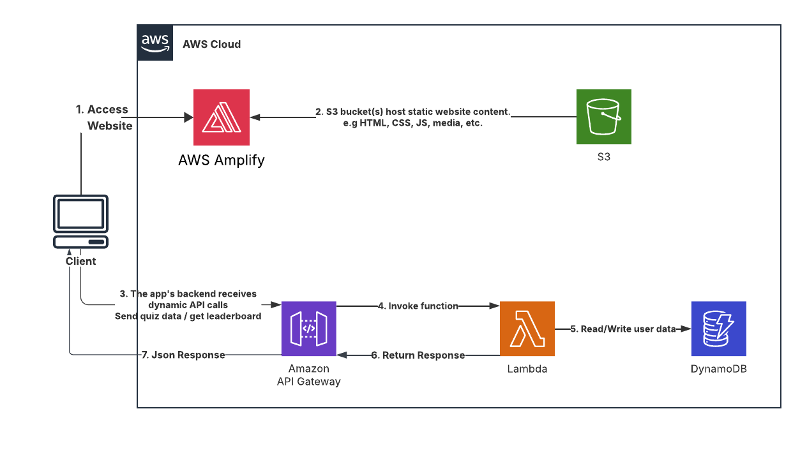

# AWS Quiz Challenge

**[AWS Quiz Challenge Live Demo](https://staging.d31ipwcs7w7err.amplifyapp.com/)** | **[🚧 Feature request](https://github.com/omar99elnemr/aws-quiz-app/issues/new?assignees=&labels=enhancement&template=feature_request.md&title=)** | **[🐛 Bug Report](https://github.com/omar99elnemr/aws-quiz-app/issues/new?assignees=&labels=bug&template=bug_report.md&title=)** | **[❓ General Question](https://github.com/omar99elnemr/aws-quiz-app/issues/new?assignees=&labels=question&template=general_question.md&title=)**

**Note**: This project is designed to stay within AWS Free Tier limits and demonstrates serverless architecture best practices.

## Table of Content

- [Solution Overview](#solution-overview)
- [Architecture Diagram](#architecture-diagram)
- [Features](#features)
- [AWS Services Used](#aws-services-used)
- [Getting Started](#getting-started)
  - [Prerequisites](#prerequisites)
  - [Backend Setup](#backend-setup)
  - [Frontend Deployment](#frontend-deployment)
- [API Documentation](#api-documentation)
- [Cost Optimization](#cost-optimization)
- [Testing](#testing)
- [Troubleshooting](#troubleshooting)

## Solution Overview

The AWS Quiz Challenge is an interactive web application that tests users' knowledge of AWS services through a timed quiz format. Built using modern web technologies and AWS serverless services, this application provides real-time scoring, a global leaderboard system, and responsive design for all devices.

The solution leverages a serverless architecture to minimize operational overhead and costs while providing scalable performance. It uses AWS Lambda for backend processing, Amazon DynamoDB for data persistence, API Gateway for RESTful APIs, and AWS Amplify for hosting and deployment.

This project serves as an excellent example of how to build a full-stack serverless application using AWS services while staying within Free Tier limits, making it ideal for learning purposes and small-scale applications.

## Architecture Diagram



The architecture consists of:
1. **Client**: Web browsers accessing the quiz application
2. **AWS Amplify**: Hosts static website content (HTML, CSS, JavaScript)
3. **Amazon S3**: Stores static assets and media files
4. **Amazon API Gateway**: Provides RESTful endpoints for quiz data
5. **AWS Lambda**: Processes quiz submissions and leaderboard requests
6. **Amazon DynamoDB**: Stores quiz scores and user data

## Features

- **Welcome Interface**: Clean name input with Enter key support
- **Timed Quiz**: 10-minute countdown timer with 10 randomized questions
- **Real-time Validation**: Immediate feedback on answer selection
- **Results Review**: Detailed score breakdown and performance analysis
- **Global Leaderboard**: Top 10 scores with completion time tie-breaker
- **Responsive Design**: Optimized for desktop, tablet, and mobile devices
- **About Page**: Project information and technical details
- **Error Handling**: Robust error management and user feedback

## AWS Services Used

### Frontend & Hosting
- **AWS Amplify**: Continuous deployment and hosting
- **Amazon S3**: Static asset storage  
- **HTML5, CSS3, JavaScript**: Frontend technologies
- **Font Awesome**: Icons and UI elements

### Backend Services
- **AWS Lambda**: Serverless compute (1M free requests/month)
- **Amazon DynamoDB**: NoSQL database (25 WCU/25 RCU free)
- **Amazon API Gateway**: RESTful API management (1M free requests/month)

### Additional Services
- **AWS IAM**: Identity and access management
- **Amazon CloudWatch**: Monitoring and logging

## Getting Started

### Prerequisites

- AWS Account with appropriate permissions
- AWS CLI configured
- Node.js 18.x or later
- Basic knowledge of HTML, CSS, JavaScript
- Understanding of AWS serverless services

### Backend Setup

#### 1. Create DynamoDB Table

```bash
aws dynamodb create-table \
    --table-name QuizScores \
    --attribute-definitions \
        AttributeName=id,AttributeType=S \
        AttributeName=timestamp,AttributeType=N \
    --key-schema \
        AttributeName=id,KeyType=HASH \
        AttributeName=timestamp,KeyType=RANGE \
    --billing-mode PAY_PER_REQUEST \
    --region us-east-1
```

#### 2. Create Lambda Functions

**Score Submission Function**:
```bash
# Create function
aws lambda create-function \
    --function-name quiz-score-submission \
    --runtime nodejs18.x \
    --role arn:aws:iam::YOUR_ACCOUNT:role/lambda-execution-role \
    --handler index.handler \
    --zip-file fileb://submit-score.zip
```

**Leaderboard Function**:
```bash
# Create function
aws lambda create-function \
    --function-name quiz-leaderboard \
    --runtime nodejs18.x \
    --role arn:aws:iam::YOUR_ACCOUNT:role/lambda-execution-role \
    --handler index.handler \
    --zip-file fileb://leaderboard.zip
```

#### 3. Configure API Gateway

```bash
# Create API
aws apigatewayv2 create-api \
    --name quiz-api \
    --protocol-type HTTP \
    --cors-configuration AllowOrigins="*",AllowHeaders="Content-Type",AllowMethods="GET,POST,OPTIONS"

# Create routes and integrations
aws apigatewayv2 create-route \
    --api-id YOUR_API_ID \
    --route-key "POST /submit" \
    --target integrations/YOUR_INTEGRATION_ID

aws apigatewayv2 create-route \
    --api-id YOUR_API_ID \
    --route-key "GET /leaderboard" \
    --target integrations/YOUR_INTEGRATION_ID
```

### Frontend Deployment

#### 1. Clone and Configure

```bash
git clone https://github.com/omar99elnemr/aws-quiz-app.git
cd aws-quiz-app
```

#### 2. Update Configuration

Update the API endpoints in your JavaScript files:
```javascript
const API_BASE_URL = 'https://your-api-id.execute-api.us-east-1.amazonaws.com';
```

**Note**: Make sure to replace `your-api-id` with your actual API Gateway ID after setting up the backend services.

#### 3. Deploy with AWS Amplify

```bash
# Initialize Amplify
amplify init

# Add hosting
amplify add hosting

# Publish
amplify publish
```

## API Documentation

### Submit Score
- **Endpoint**: `POST /submit`
- **Headers**: `Content-Type: application/json`
- **Body**:
  ```json
  {
    "name": "string",
    "score": "number",
    "completionTime": "number"
  }
  ```
- **Response**:
  ```json
  {
    "message": "Score submitted successfully",
    "isInTop10": "boolean"
  }
  ```

### Get Leaderboard
- **Endpoint**: `GET /leaderboard`
- **Response**:
  ```json
  {
    "scores": [
      {
        "name": "string",
        "score": "number",
        "completionTime": "number",
        "date": "string"
      }
    ]
  }
  ```

## Cost Optimization

### Free Tier Utilization
- **AWS Lambda**: 1M free requests/month, 400,000 GB-seconds compute
- **DynamoDB**: 25 WCU/RCU, 25 GB storage
- **API Gateway**: 1M free requests/month
- **S3**: 5 GB storage, 20,000 GET requests, 2,000 PUT requests
- **Amplify**: 1,000 build minutes, 15 GB served per month

### Best Practices
1. **DynamoDB**: Use on-demand billing for unpredictable traffic
2. **Lambda**: Optimize memory allocation and execution time
3. **API Gateway**: Implement caching for frequently accessed data
4. **S3**: Use appropriate storage classes for different content types

## Testing

### Local Testing
```bash
# Test API endpoints
curl -X POST https://your-api-url/submit \
  -H "Content-Type: application/json" \
  -d '{"name":"Test User","score":80,"completionTime":300}'

curl -X GET https://your-api-url/leaderboard
```

### Frontend Testing
1. Test name submission with Enter key and button click
2. Verify quiz timer functionality and countdown
3. Check answer selection and navigation between questions
4. Test submission with complete and incomplete answers
5. Verify leaderboard updates and display
6. Test responsive design across different devices

## Troubleshooting

### Common Issues

**CORS Errors**:
- Verify API Gateway CORS configuration
- Check that all methods include proper headers

**Lambda Function Errors**:
- Check CloudWatch logs for detailed error messages
- Verify IAM permissions for DynamoDB access

**DynamoDB Access Issues**:
- Ensure Lambda execution role has required permissions
- Verify table name and region configuration

**Frontend Not Loading**:
- Check browser console for JavaScript errors
- Verify API endpoint URLs are correct
- Ensure Amplify deployment was successful

### Debugging Steps
1. Check AWS CloudWatch logs for Lambda functions
2. Verify API Gateway request/response in AWS Console
3. Test DynamoDB operations using AWS CLI
4. Use browser developer tools for frontend debugging

## Recent Updates

- **v1.2.0**: Added Enter key support for name submission
- **v1.1.0**: Improved quiz options formatting and mobile responsiveness
- **v1.0.1**: Fixed quiz submission functionality and error handling
- **v1.0.0**: Initial release with core quiz functionality

---

**Built with ❤️ using AWS Serverless Technologies**
